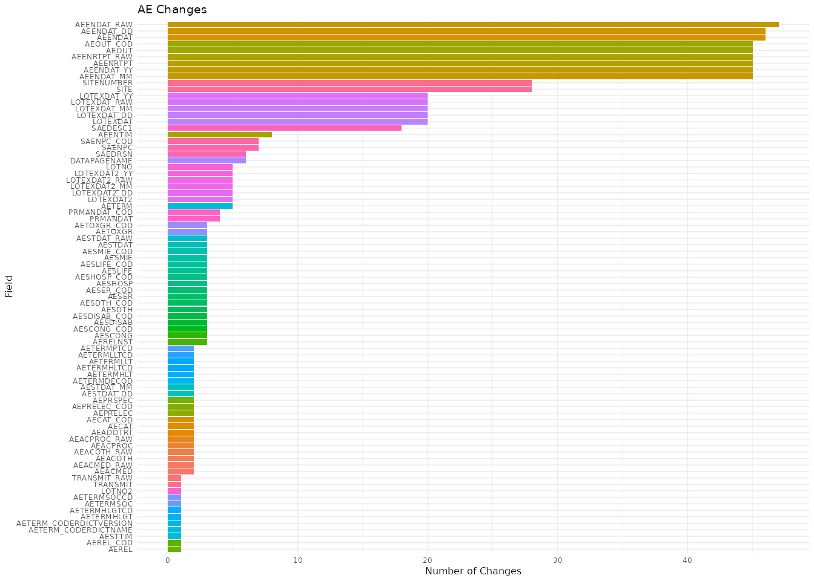
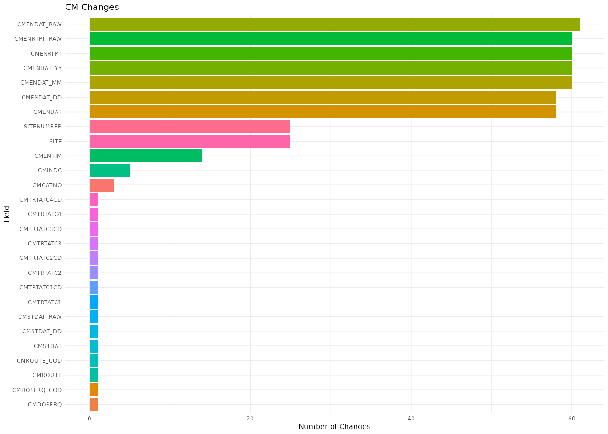
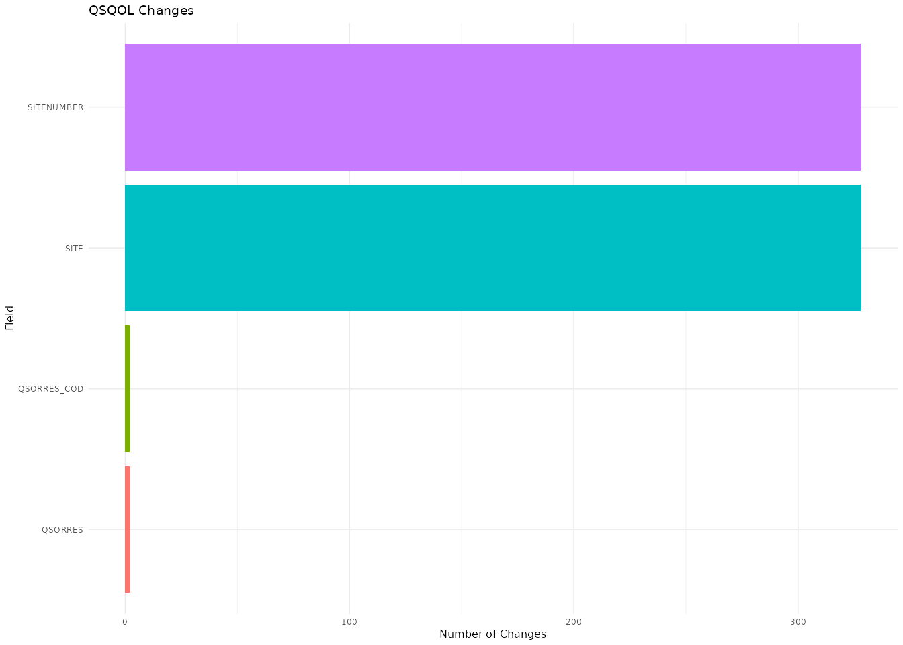
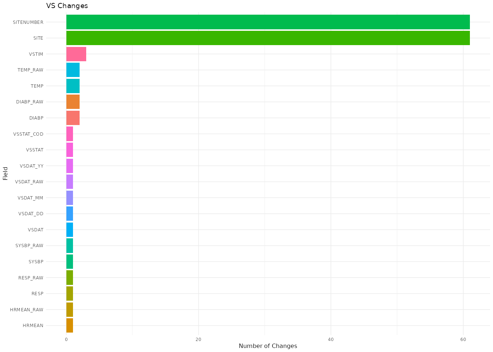

# change-frequency-from-proc-compare

``` r

library(dfdiffs)
library(openxlsx)
library(readxl)
library(tidyverse)
library(janitor) 
library(arsenal) # comparedf
library(diffdf)  # diffdf
```

## Motivation

In this vignette I’ll cover how to calculate the frequency of changes
per column for each dataset in a PROC COMPARE output file,
`snapshot_compare_270301_20221116_year3_preview_noDAP.xlsx`.

We’ll import the Excel file, then build a regular expression for
separating the changes recorded in the `value_changes` column (the
cleaned name of the `Value changes` column).

## Import data

The code below lists the sheet names in the
`snapshot_compare_270301_20221116_year3_preview_noDAP.xlsx` file.

``` r

snapshot_pth <- "../inst/extdata/xlsx/snapshot_compare_270301_20221116_year3_preview_noDAP.xlsx"
snapshoty3_sheets <- readxl::excel_sheets(snapshot_pth)
snapshoty3_sheets
#>  [1] "Summary"       "Key variables" "AE"            "AEYN"         
#>  [5] "CER"           "CM"            "CMAIS"         "DM"           
#>  [9] "DS"            "DSIC"          "DSLB"          "DSSH"         
#> [13] "DSSS"          "ECIF"          "EG"            "ENR"          
#> [17] "FAFS"          "FALB"          "FALBA"         "IE"           
#> [21] "LBC"           "LBCG"          "LBF8GENO"      "LBF8GENO_CP"  
#> [25] "LBH"           "LBU"           "LBV"           "MH"           
#> [29] "MHB"           "MHH"           "MHT"           "MOU"          
#> [33] "PE"            "PEH"           "PR"            "PREGFU"       
#> [37] "PRGRPT"        "PROTDEV"       "QSEM"          "QSEQ"         
#> [41] "QSHAL"         "QSHAL2"        "QSPROBE"       "QSPROBE2"     
#> [45] "QSQOL"         "QSWPAI"        "SRS"           "SV"           
#> [49] "UCRF"          "VS"            "VST"
```

### AE

We’ll import the `"AE"` sheet and check the column names.

``` r

snap_ae_raw <- readxl::read_excel(snapshot_pth, sheet = "AE") 
#> New names:
#> • `Surgical Procedure` -> `Surgical Procedure...92`
#> • `Surgical Procedure` -> `Surgical Procedure...94`
names(snap_ae_raw) |> head(10)
#>  [1] "DATASET"                    "Subject name or identifier"
#>  [3] "Site name"                  "Project"                   
#>  [5] "Folder instance name"       "Folder OID"                
#>  [7] "Folder name"                "SiteNumber"                
#>  [9] "Environment"                "eCRF Form Name"
names(snap_ae_raw) |> tail(10)
#>  [1] "Reporter Last Name"                                  
#>  [2] "E2B Transmit Flag"                                   
#>  [3] "E2B Transmit Flag(Character)"                        
#>  [4] "Transmit"                                            
#>  [5] "Transmit(Character)"                                 
#>  [6] "Relationship to immunosuppressant therapy"           
#>  [7] "Relationship to immunosuppressant therapyCoded Value"
#>  [8] "STATUS"                                              
#>  [9] "Value changes"                                       
#> [10] "NEWVALUES"
```

Next, we’ll select and rename the columns we need, clean their names,
and filter the `"AE"` dataset to the rows with an `"Updated"` value in
the `status` column.

``` r

snap_updated <- snap_ae_raw |>  
  select(
    subject_id = `Subject name or identifier`, 
    record_num = `Record number`,
    DATASET, 
    STATUS, 
    `Value changes`, 
    NEW_VALUES = NEWVALUES) %>% 
  janitor::clean_names() |> 
  filter(status == "Updated")
glimpse(snap_updated)
#> Rows: 114
#> Columns: 6
#> $ subject_id    <chr> "0009-3901", "0023-3904", "0023-3905", "0109-3901", "010…
#> $ record_num    <dbl> 0, 0, 0, 0, 0, 0, 0, 0, 0, 0, 0, 0, 0, 0, 0, 0, 0, 0, 0,…
#> $ dataset       <chr> "AE", "AE", "AE", "AE", "AE", "AE", "AE", "AE", "AE", "A…
#> $ status        <chr> "Updated", "Updated", "Updated", "Updated", "Updated", "…
#> $ value_changes <chr> "SAENPC=, SAENPC_COD=, AERELNST=, SAEDESC1=ALT on 12/7/2…
#> $ new_values    <chr> "SAENPC=Yes, SAENPC_COD=Y, AERELNST=unknown, SAEDESC1=AL…
```

#### Testing `SAEDESC1`

Changes to `SAEDESC1` contain a lot of unstructured text with multiple
commas, which makes them a good test case for separating the column
names from the `value_changes` column.

``` r

test_SAEDESC1 <- snap_updated |> 
  filter(str_detect(snap_updated$value_changes, "SAEDESC1")) |> 
  head(3)
glimpse(test_SAEDESC1)
#> Rows: 3
#> Columns: 6
#> $ subject_id    <chr> "0009-3901", "0146-3901", "0157-3902"
#> $ record_num    <dbl> 0, 0, 0
#> $ dataset       <chr> "AE", "AE", "AE"
#> $ status        <chr> "Updated", "Updated", "Updated"
#> $ value_changes <chr> "SAENPC=, SAENPC_COD=, AERELNST=, SAEDESC1=ALT on 12/7/2…
#> $ new_values    <chr> "SAENPC=Yes, SAENPC_COD=Y, AERELNST=unknown, SAEDESC1=AL…
```

#### Testing the regular expression

Below is the regular expression we’ll test these rows against.

``` r

sas_cols_regex <- "\\w*[A-Z]\\w*[A-Z]\\w*="
sas_cols_regex
#> [1] "\\w*[A-Z]\\w*[A-Z]\\w*="
```

We’ll use
[`str_view_all()`](https://stringr.tidyverse.org/reference/str_view.html)
to check whether the regular expression matches the column names.

``` r

str_view_all(string = test_SAEDESC1$value_changes, 
  pattern = sas_cols_regex) 
#> Warning: `str_view_all()` was deprecated in stringr 1.5.0.
#> ℹ Please use `str_view()` instead.
#> This warning is displayed once per session.
#> Call `lifecycle::last_lifecycle_warnings()` to see where this warning was
#> generated.
#> [1] │ <SAENPC=>, <SAENPC_COD=>, <AERELNST=>, <SAEDESC1=>ALT on 12/7/2021: 36; baseline = 24, <AETOXGR=>, <AETOXGR_COD=>, <AEREL=>, <AEREL_COD=>
#> [2] │ <PRMANDAT=>No, <PRMANDAT_COD=>N, <LOTNO=>L271036, <LOTEXDAT=>31JAN2020:00:00:00.000, <LOTEXDAT_RAW=>31 Jan 2020, <LOTEXDAT_YY=>2020, <LOTEXDAT_MM=>1, <LOTEXDAT_DD=>31, <SAENPC=>Yes, <SAENPC_COD=>Y, <SAEDESC1=>Central AST: 147
#> [3] │ <SAEDRSN=>, <SAEDESC1=>.
```

### `count_change_columns()`

Now that we have a regular expression that matches the column names in
`value_changes`, we’ll write a function that counts the occurrences of
each match.

``` r

count_change_columns <- function(df) {
  sas_cols_regex <- "\\w*[A-Z]\\w*[A-Z]\\w*="
  # clean names
  df_clean_nms <- df |> janitor::clean_names()
  # value_changes
  value_change_match <- dplyr::mutate(df_clean_nms, 
         raw_col_match = stringr::str_match_all(value_changes, 
                                                sas_cols_regex)) |> 
    dplyr::relocate(raw_col_match, .after = 1)
  # unnest 
  raw_matches_long <- tidyr::unnest_longer(data = value_change_match, 
                                  col = raw_col_match)
  col_matches_long <- dplyr::mutate(.data = raw_matches_long,
      col_matches = stringr::str_remove_all(raw_col_match, "=")) |> 
    dplyr::relocate(col_matches, .after = 2)
  col_count_raw <- dplyr::count(col_matches_long, col_matches, 
                            name = "occurrence")
  col_count <- dplyr::filter(col_count_raw, !is.na(col_matches))
  count_tbl <- dplyr::rename(.data = col_count,
    Field = col_matches,
    ChangeCount = occurrence
  )
  return(count_tbl)
}
```

### Field and Change Count

We can derive `Field` and `ChangeCount` by passing `snap_ae_raw` (the
data imported from the spreadsheet) to `count_change_columns()`.

``` r

ae_change_freq <- count_change_columns(df = snap_ae_raw)
ae_change_freq
#> # A tibble: 82 × 2
#>    Field                   ChangeCount
#>    <chr>                         <int>
#>  1 AEACMED                           2
#>  2 AEACMED_RAW                       2
#>  3 AEACOTH                           2
#>  4 AEACOTH_RAW                       2
#>  5 AEACPROC                          2
#>  6 AEACPROC_RAW                      2
#>  7 AEADDTRT                          2
#>  8 AECAT                             2
#>  9 AECAT_COD                         2
#> 10 AEENDAT                          46
#> 11 AEENDAT_DD                       46
#> 12 AEENDAT_MM                       45
#> 13 AEENDAT_RAW                      47
#> 14 AEENDAT_YY                       45
#> 15 AEENRTPT                         45
#> 16 AEENRTPT_RAW                     45
#> 17 AEENTIM                           8
#> 18 AEOUT                            45
#> 19 AEOUT_COD                        45
#> 20 AEPRELEC                          2
#> 21 AEPRELEC_COD                      2
#> 22 AEPRSPEC                          2
#> 23 AEREL                             1
#> 24 AERELNST                          3
#> 25 AEREL_COD                         1
#> 26 AESCONG                           3
#> 27 AESCONG_COD                       3
#> 28 AESDISAB                          3
#> 29 AESDISAB_COD                      3
#> 30 AESDTH                            3
#> 31 AESDTH_COD                        3
#> 32 AESER                             3
#> 33 AESER_COD                         3
#> 34 AESHOSP                           3
#> 35 AESHOSP_COD                       3
#> 36 AESLIFE                           3
#> 37 AESLIFE_COD                       3
#> 38 AESMIE                            3
#> 39 AESMIE_COD                        3
#> 40 AESTDAT                           3
#> 41 AESTDAT_DD                        2
#> 42 AESTDAT_MM                        2
#> 43 AESTDAT_RAW                       3
#> 44 AESTTIM                           1
#> 45 AETERM                            5
#> 46 AETERMDECOD                       2
#> 47 AETERMHLGT                        1
#> 48 AETERMHLGTCD                      1
#> 49 AETERMHLT                         2
#> 50 AETERMHLTCD                       2
#> 51 AETERMLLT                         2
#> 52 AETERMLLTCD                       2
#> 53 AETERMPTCD                        2
#> 54 AETERMSOC                         1
#> 55 AETERMSOCCD                       1
#> 56 AETERM_CODERDICTNAME              1
#> 57 AETERM_CODERDICTVERSION           1
#> 58 AETOXGR                           3
#> 59 AETOXGR_COD                       3
#> 60 DATAPAGENAME                      6
#> 61 LOTEXDAT                         20
#> 62 LOTEXDAT2                         5
#> 63 LOTEXDAT2_DD                      5
#> 64 LOTEXDAT2_MM                      5
#> 65 LOTEXDAT2_RAW                     5
#> 66 LOTEXDAT2_YY                      5
#> 67 LOTEXDAT_DD                      20
#> 68 LOTEXDAT_MM                      20
#> 69 LOTEXDAT_RAW                     20
#> 70 LOTEXDAT_YY                      20
#> 71 LOTNO                             5
#> 72 LOTNO2                            1
#> 73 PRMANDAT                          4
#> 74 PRMANDAT_COD                      4
#> 75 SAEDESC1                         18
#> 76 SAEDRSN                           6
#> 77 SAENPC                            7
#> 78 SAENPC_COD                        7
#> 79 SITE                             28
#> 80 SITENUMBER                       28
#> 81 TRANSMIT                          1
#> 82 TRANSMIT_RAW                      1
```

### Graph Changes

We can graph these changes, but we have to set the font size manually
because of the long `y` axis.

``` r

ggplot(data = ae_change_freq, 
       mapping = aes(x = ChangeCount, 
                     y = forcats::fct_reorder(.f = Field, 
                                              .x = ChangeCount))) + 
  geom_col(aes(fill = Field), show.legend = FALSE) + 
  labs(title = "AE Changes", 
       y = "Field", 
       x = "Number of Changes") + 
  theme_minimal(base_size = 6)
```



## Map to other sheets

Now we can apply `count_change_columns()` to every sheet in
`snapshot_compare_270301_20221116_year3_preview_noDAP.xlsx`.

First, we remove the `Summary` and `Key variables` sheets from
`snapshoty3_sheets`.

``` r

form_sheets <- snapshoty3_sheets[! snapshoty3_sheets %in% c('Summary', 'Key variables')]
form_sheets
#>  [1] "AE"          "AEYN"        "CER"         "CM"          "CMAIS"      
#>  [6] "DM"          "DS"          "DSIC"        "DSLB"        "DSSH"       
#> [11] "DSSS"        "ECIF"        "EG"          "ENR"         "FAFS"       
#> [16] "FALB"        "FALBA"       "IE"          "LBC"         "LBCG"       
#> [21] "LBF8GENO"    "LBF8GENO_CP" "LBH"         "LBU"         "LBV"        
#> [26] "MH"          "MHB"         "MHH"         "MHT"         "MOU"        
#> [31] "PE"          "PEH"         "PR"          "PREGFU"      "PRGRPT"     
#> [36] "PROTDEV"     "QSEM"        "QSEQ"        "QSHAL"       "QSHAL2"     
#> [41] "QSPROBE"     "QSPROBE2"    "QSQOL"       "QSWPAI"      "SRS"        
#> [46] "SV"          "UCRF"        "VS"          "VST"
```

Then we name each element in the vector with its own sheet name and
store the result in `form_sheets_nmd`.

``` r

form_sheets_nmd <- purrr::set_names(form_sheets)
form_sheets_nmd
#>            AE          AEYN           CER            CM         CMAIS 
#>          "AE"        "AEYN"         "CER"          "CM"       "CMAIS" 
#>            DM            DS          DSIC          DSLB          DSSH 
#>          "DM"          "DS"        "DSIC"        "DSLB"        "DSSH" 
#>          DSSS          ECIF            EG           ENR          FAFS 
#>        "DSSS"        "ECIF"          "EG"         "ENR"        "FAFS" 
#>          FALB         FALBA            IE           LBC          LBCG 
#>        "FALB"       "FALBA"          "IE"         "LBC"        "LBCG" 
#>      LBF8GENO   LBF8GENO_CP           LBH           LBU           LBV 
#>    "LBF8GENO" "LBF8GENO_CP"         "LBH"         "LBU"         "LBV" 
#>            MH           MHB           MHH           MHT           MOU 
#>          "MH"         "MHB"         "MHH"         "MHT"         "MOU" 
#>            PE           PEH            PR        PREGFU        PRGRPT 
#>          "PE"         "PEH"          "PR"      "PREGFU"      "PRGRPT" 
#>       PROTDEV          QSEM          QSEQ         QSHAL        QSHAL2 
#>     "PROTDEV"        "QSEM"        "QSEQ"       "QSHAL"      "QSHAL2" 
#>       QSPROBE      QSPROBE2         QSQOL        QSWPAI           SRS 
#>     "QSPROBE"    "QSPROBE2"       "QSQOL"      "QSWPAI"         "SRS" 
#>            SV          UCRF            VS           VST 
#>          "SV"        "UCRF"          "VS"         "VST"
```

### Import all sheets

We can now import every sheet from the file at `snapshot_pth` and store
them in the `all_sheets` list.

``` r

all_sheets <- form_sheets_nmd |> 
  map(~ readxl::read_excel(path = snapshot_pth, sheet = .x))
#> New names:
#> New names:
#> New names:
#> New names:
#> New names:
#> New names:
#> • `Surgical Procedure` -> `Surgical Procedure...92`
#> • `Surgical Procedure` -> `Surgical Procedure...94`
```

The names of `all_sheets` confirm the list contains every imported
sheet.

``` r

names(all_sheets)
#>  [1] "AE"          "AEYN"        "CER"         "CM"          "CMAIS"      
#>  [6] "DM"          "DS"          "DSIC"        "DSLB"        "DSSH"       
#> [11] "DSSS"        "ECIF"        "EG"          "ENR"         "FAFS"       
#> [16] "FALB"        "FALBA"       "IE"          "LBC"         "LBCG"       
#> [21] "LBF8GENO"    "LBF8GENO_CP" "LBH"         "LBU"         "LBV"        
#> [26] "MH"          "MHB"         "MHH"         "MHT"         "MOU"        
#> [31] "PE"          "PEH"         "PR"          "PREGFU"      "PRGRPT"     
#> [36] "PROTDEV"     "QSEM"        "QSEQ"        "QSHAL"       "QSHAL2"     
#> [41] "QSPROBE"     "QSPROBE2"    "QSQOL"       "QSWPAI"      "SRS"        
#> [46] "SV"          "UCRF"        "VS"          "VST"
```

### Map `count_change_columns()` to `all_sheets`

We’ll [`map()`](https://purrr.tidyverse.org/reference/map.html)
`count_change_columns()` over each element in `all_sheets` and store the
results in the `all_field_counts` list.

``` r

all_field_counts <- purrr::map(.x = all_sheets, .f = count_change_columns)
names(all_field_counts)
#>  [1] "AE"          "AEYN"        "CER"         "CM"          "CMAIS"      
#>  [6] "DM"          "DS"          "DSIC"        "DSLB"        "DSSH"       
#> [11] "DSSS"        "ECIF"        "EG"          "ENR"         "FAFS"       
#> [16] "FALB"        "FALBA"       "IE"          "LBC"         "LBCG"       
#> [21] "LBF8GENO"    "LBF8GENO_CP" "LBH"         "LBU"         "LBV"        
#> [26] "MH"          "MHB"         "MHH"         "MHT"         "MOU"        
#> [31] "PE"          "PEH"         "PR"          "PREGFU"      "PRGRPT"     
#> [36] "PROTDEV"     "QSEM"        "QSEQ"        "QSHAL"       "QSHAL2"     
#> [41] "QSPROBE"     "QSPROBE2"    "QSQOL"       "QSWPAI"      "SRS"        
#> [46] "SV"          "UCRF"        "VS"          "VST"
```

We can check the results by graphing the changes in a few of the forms.

#### CM Changes

The graph below shows the number of changes per field in the `CM` form.

``` r

all_field_counts$CM |> 
  ggplot(mapping = aes(x = ChangeCount, 
                     y = forcats::fct_reorder(.f = Field, 
                                              .x = ChangeCount))) + 
  geom_col(aes(fill = Field), show.legend = FALSE) + 
  labs(title = "CM Changes", 
       y = "Field", 
       x = "Number of Changes") + 
  theme_minimal(base_size = 6)
```



#### QSQOL Changes

The graph below shows the number of changes per field in the `QSQOL`
form.

``` r

all_field_counts$QSQOL |> 
  ggplot(mapping = aes(x = ChangeCount, 
                     y = forcats::fct_reorder(.f = Field, 
                                              .x = ChangeCount))) + 
  geom_col(aes(fill = Field), show.legend = FALSE) + 
  labs(title = "QSQOL Changes", 
       y = "Field", 
       x = "Number of Changes") + 
  theme_minimal(base_size = 6)
```



#### VS Changes

The graph below shows the number of changes per field in the `VS` form.

``` r

all_field_counts$VS |> 
  ggplot(mapping = aes(x = ChangeCount, 
                     y = forcats::fct_reorder(.f = Field, 
                                              .x = ChangeCount))) + 
  geom_col(aes(fill = Field), show.legend = FALSE) + 
  labs(title = "VS Changes", 
       y = "Field", 
       x = "Number of Changes") + 
  theme_minimal(base_size = 6)
```



### Export field count tables

We can export these tables to the `inst/out/` folder as
`all-field-counts.xlsx`, with one sheet per form.

``` r

library(openxlsx)
# create wb
openxlsx::write.xlsx(x = all_field_counts,
                file = "../inst/out/all-field-counts.xlsx")
```
