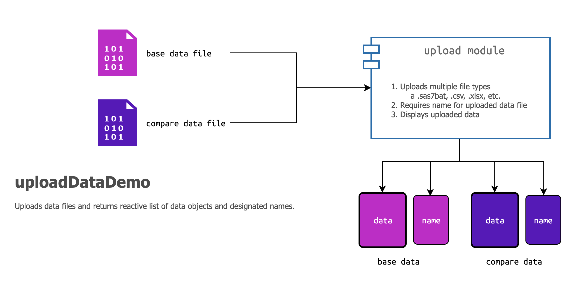
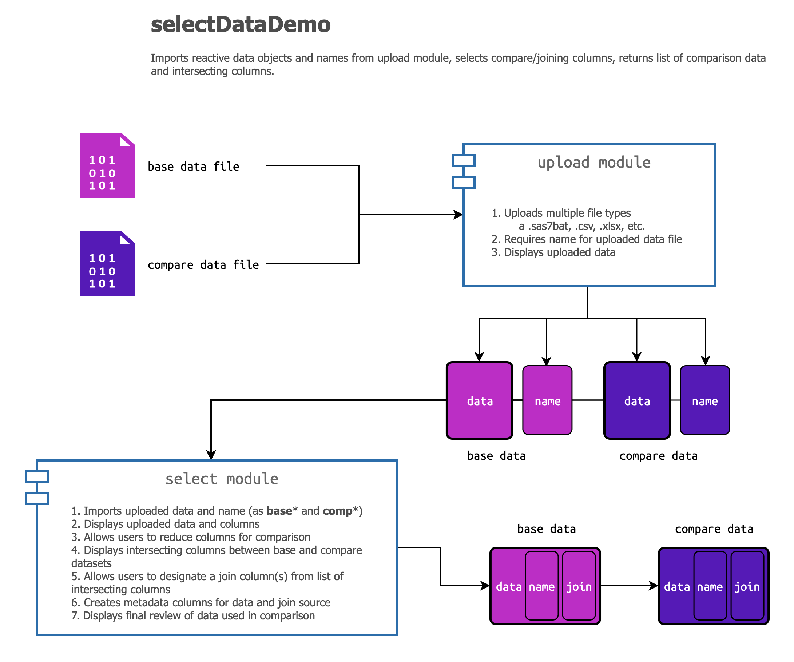
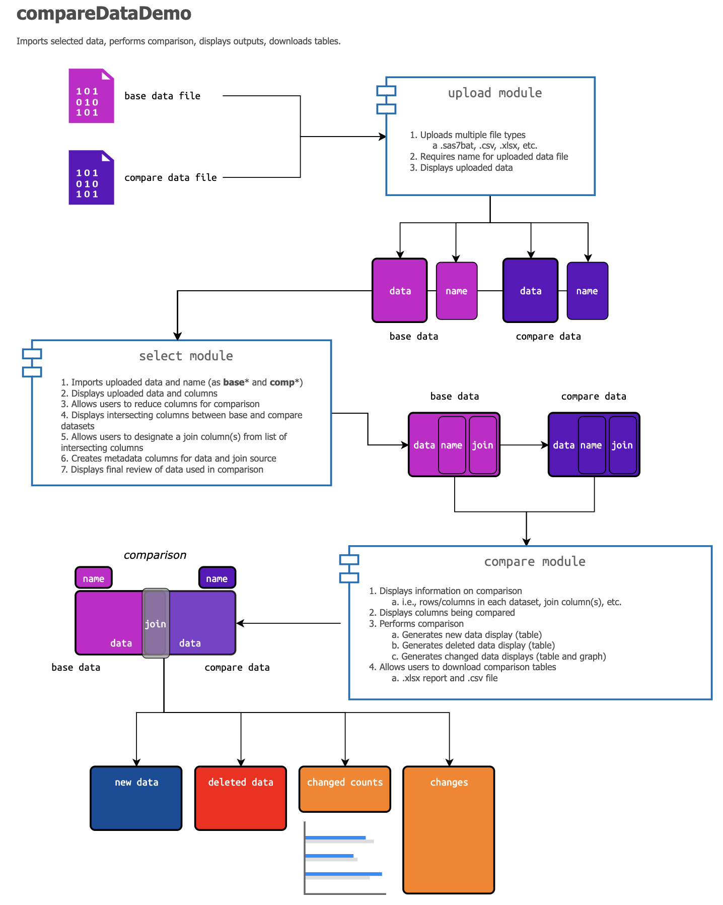

```{r setup, include=FALSE}
library(knitr)
library(rmdformats)

library(devtools)
library(hrbrthemes)
library(fs)
library(reactable)
library(rmarkdown)
library(shiny)
library(shinythemes)
library(bs4Dash)
library(openxlsx)
# Global options
knitr::opts_chunk$set(
  # cache = FALSE # cache data
  echo = TRUE, # show/hide all code
  # results = "hide", # hide results
  tidy = FALSE, # cleaner code printing
  comment = "#> ", # better console printing
  eval = TRUE, # turn this to FALSE stop code chunks from running
  message = TRUE, # show messages
  warning = FALSE, # show warnings
  size = "tiny", # size of the text
  fig.path = "images", # location of figure files
  fig.height = 7.5, # height of figures
  fig.width = 10 # width of figures
)
# knit options
knitr::opts_knit$set(
  width = 78,
  progress = FALSE
)
# base options
base::options(
  tibble.print_max = 25,
  tibble.width = 78,
  max.print = 999999,
  scipen = 100000000
)
```

# Purpose

The `dfdiffs` package contains functions for answering the following questions (given two datasets):

1.  What rows are here now that weren't here before?\
2.  What rows were here before that aren't here now?\
3.  What values have been changed?

The goal of this document is to test the `compareDataDemo` module, which compares two data sources to get 1) new data, 2) deleted data, and 3) changed data.

# Helpers

We've included a `helpers.R` file that contains the functions we're using in the module.

## Comparison functions

These functions are used to compare two datasets and produce output tables for download or review.

### New data 

1.  **`create_new_data(compare = , base = , by = , by_col = , cols = )`**: takes two datasets and returns a dataset of, "*what is here now that wasn't here before?*

### Deleted data

2.  **`create_deleted_data(compare = , base = , by = , by_col = , cols = )`**: takes two datasets and creates a dataset of, "*What was here before that isn't here now?*

### Changed/modified data

3.  **`create_modified_data(compare = , base = , by = , by_col = , cols = )`**: takes two datasets and creates a dataset of, "*What has changed?*

4.  **`create_changed_data(compare = , base = , by = , by_col = , cols = )`**: takes two datasets and creates a dataset of, "*What has changed?*

These are all stored in the `helpers.R` file (sourced below):

```{r helpers}
source("helpers.R")
```

# Comparison data

We're going to import two datasets to simulate the application's compare functions. We'll be using two set's of the Master dataset from the [Lahman baseball database](https://github.com/cdalzell/Lahman). We chose this data because 1) they're relatively large (15,000+ rows), they're normalized (have an id: `playerID`), and they've been collected and updated over multiple years (i.e. lots of changes).

## Test `base` data

Our 'base' or 'target' dataset is the 2015 Master dataset.

```{r master15, message=FALSE, warning=FALSE}
master15 <- readr::read_csv("data/csv/m15.csv")
```

## Test `compare` data

Our 'compare' or 'new' dataset is the 2020 People dataset

```{r master22, message=FALSE, warning=FALSE}
master22 <- readr::read_csv("data/csv/m22.csv")
```


```{r export, eval=FALSE, echo=FALSE}
# T10 <- readr::read_csv("data/csv/Teams2010.csv")
# T10 <- mutate(T10, across(where(is.logical), as.character))
# T15 <- readr::read_csv("data/csv/Teams2015.csv")
# T15 <- mutate(T15, across(where(is.logical), as.character))
# wb <- createWorkbook()
# addWorksheet(wb, 
#     sheetName = "teams-2010", gridLines = FALSE)
# addWorksheet(wb, 
#     sheetName = "teams-2015", gridLines = FALSE)
# writeDataTable(wb, 
#     sheet = "teams-2010", x = T10, colNames = TRUE)
# writeDataTable(wb, 
#     sheet = "teams-2015", x = T15, colNames = TRUE)
# saveWorkbook(wb, "data/teams10-15.xlsx",
#              overwrite = TRUE)
# t10 <- readxl::read_excel(path = "data/teams10-15.xlsx", 
#                    sheet = "teams-2010")
# t15 <- readxl::read_excel(path = "data/teams10-15.xlsx", 
#                    sheet = "teams-2015")
# base_data <- create_join_column(df = master15, 
#   by_colums = "playerID", new_by_column_name = "join_column")
# # join column
# base_data <- tibble::add_column(.data = base_data,
#   join_source = "playerID", .after = 1)
# # data source column
# base_data <- tibble::add_column(.data = base_data,
#   data_source = "m15", .after = 1)
# compare_cols <- base_data |> names()
# select(
#   master15,
#   playerID, contains("name"),
#   contains("birth"), contains("death")
# ) |>
#   write_csv("data/csv/m15.csv")
# 
# select(
#   master22,
#   playerID, contains("name"),
#   contains("birth"), contains("death")
# ) |>
#   write_csv(file = "data/csv/m22.csv")
```

# Data displays

Both base and compare datasets will be differentiated by color in the application using the `reactable::reactableTheme()` function.

## Base display

The base color will use the `#761763` background color (based violet (`#a9218e`) :

```{r base_react_theme}
base_react_theme <- reactableTheme(
  color = "#FFFFFF",
  backgroundColor = "#761763",
  borderColor = "#646464",
  stripedColor = "#3A3B45",
  highlightColor = "#a9218e",
  inputStyle = list(backgroundColor = "#3A3B45"),
  selectStyle = list(backgroundColor = "#3A3B45"),
  pageButtonHoverStyle = list(backgroundColor = "3A3B45"),
  pageButtonActiveStyle = list(backgroundColor = "#3A3B45")
)
reactable::reactable(master15,
  theme = base_react_theme
)
```

## Compare display

The compare color will use the `#2f3688` background color (based purple (`#353d98`) :

```{r comp_react_theme}
comp_react_theme <- reactableTheme(
  color = "#FFFFFF",
  backgroundColor = "#2f3688",
  borderColor = "#646464",
  stripedColor = "#3A3B45",
  highlightColor = "#353d98",
  inputStyle = list(backgroundColor = "#3A3B45"),
  selectStyle = list(backgroundColor = "#3A3B45"),
  pageButtonHoverStyle = list(backgroundColor = "3A3B45"),
  pageButtonActiveStyle = list(backgroundColor = "#3A3B45")
)
reactable::reactable(master22,
  theme = comp_react_theme
)
```

## New Records

We'll test the `create_new_data()` function on the 2015 vs. 2020 Master data.

```{r create_new_data, class.source='fold-show'}
# run new data function
new <- create_new_data(master22, master15,
  by = "playerID",
  cols = c("playerID", "nameFirst", "nameLast", "nameGiven", "birthCity")
)
```

We'll also apply the `new_react_theme` to this display:

```{r reactable-new}
new_react_theme <- reactableTheme(
  color = "#00509C",
  backgroundColor = "#FFFFFF",
  borderColor = "#A0A0A0",
  stripedColor = "#3A3B45",
  highlightColor = "#eeeeee",
  inputStyle = list(backgroundColor = "#eeeeee"),
  selectStyle = list(backgroundColor = "#eeeeee"),
  pageButtonHoverStyle = list(backgroundColor = "3A3B45"),
  pageButtonActiveStyle = list(backgroundColor = "#3A3B45")
)
reactable(new,
  defaultPageSize = 10,
  resizable = TRUE,
  highlight = TRUE,
  compact = TRUE,
  wrap = FALSE,
  bordered = TRUE,
  filterable = TRUE,
  theme = new_react_theme
)
```

In order to check these data, we can test the unique `playerID`s in and see if they're in the `master15` dataset.

```{r new_playerID, class.source='fold-show'}
# unique ids
new_playerID <- unique(new$playerID)
# filter new ids (should be zero)
reactable(
  filter(master15,
  playerID %in% new_playerID),
  defaultPageSize = 10,
  resizable = TRUE,
  highlight = TRUE,
  compact = TRUE,
  wrap = FALSE,
  bordered = TRUE,
  filterable = TRUE,
  theme = new_react_theme)
```

And we can see **none** of these `playerID`s are in the base dataset.

## Deleted Records

We're going to check the deleted records using the `create_deleted_data()` function.

```{r create_deleted_data, class.source='fold-show'}
deleted <- create_deleted_data(
  compare = master22,
  base = master15,
  by = "playerID",
  cols = c("playerID", "nameFirst", "nameLast", "nameGiven", "birthCity")
)
```

We'll also apply the `deleted_react_theme` to this display:

```{r reactable-deleted}
deleted_react_theme <- reactableTheme(
  color = "#d62b46",
  backgroundColor = "#FFFFFF",
  borderColor = "#A0A0A0",
  stripedColor = "#3A3B45",
  highlightColor = "#eeeeee",
  inputStyle = list(backgroundColor = "#eeeeee"),
  selectStyle = list(backgroundColor = "#eeeeee"),
  pageButtonHoverStyle = list(backgroundColor = "3A3B45"),
  pageButtonActiveStyle = list(backgroundColor = "#3A3B45")
)

reactable(deleted,
  defaultPageSize = 10,
  theme = deleted_react_theme,
  resizable = TRUE,
  highlight = TRUE,
  compact = TRUE,
  wrap = FALSE,
  bordered = TRUE,
  filterable = TRUE
)
```

This tells us there were 625 deleted records between 2015 and 2020 in the master dataset.


## Changed Records

Below we create three variations of the changed data.

```{r changes, class.source='fold-show'}
change_row_by_row <- create_changed_data(compare = master22, master15, 
                                  cols = c("playerID", "nameFirst", 
                                           "nameLast", "nameGiven", 
                                           "birthCity"))
change_single_id  <- create_changed_data(compare = master22, master15,
                                  by = "playerID", 
                                  by_col = "join_column",
                                  cols = c("nameFirst", "nameLast",
                                           "nameGiven", "birthCity"))
change_multiple_ids <- create_changed_data(compare = master22, master15,
                                  by = c("playerID", "nameGiven"),
                                  by_col = "join_column",
                                  cols = c("playerID", "nameFirst", 
                                           "nameLast", "nameGiven", 
                                           "birthCity"))
names(change_row_by_row)
```

## Output tables 

All data comparisons performed with `create_changed_data()` will have at least two table outputs: `num_diffs` and `var_diffs`. 

### Row-by-row comparisons 

If no `by` column is provided, these are the only two tables returned.

```{r names-change_row_by_row}
names(change_row_by_row)
```

### Single `by` column comparisons 

A single `by` column will return four tables,

```{r names-change_single_id}
names(change_single_id)
```

### Multiple `by` column comparisons 

Multiple `by` columns will also return four tables,

```{r names-change_multiple_ids}
names(change_multiple_ids)
```


#### Numerical differences

Below are the numerical differences (`num_diffs`) for `change_row_by_row`, `change_single_id`, and `change_multiple_ids`. The `num_diffs` table contains counts of all the variables with differences.

```{r change_row_by_row-num_diffs}
reactable(
  data = change_row_by_row$num_diffs,
  defaultPageSize = 10,
  theme = changed_react_theme,
  resizable = TRUE,
  highlight = TRUE,
  compact = TRUE,
  wrap = FALSE,
  bordered = TRUE,
  filterable = TRUE
)

```


```{r change_single_id-num_diffs}
reactable(
  data = change_single_id$num_diffs,
  defaultPageSize = 10,
  theme = changed_react_theme,
  resizable = TRUE,
  highlight = TRUE,
  compact = TRUE,
  wrap = FALSE,
  bordered = TRUE,
  filterable = TRUE
)
```

```{r change_multiple_ids-num_diffs}
reactable(
  data = change_multiple_ids$num_diffs,
  defaultPageSize = 10,
  theme = changed_react_theme,
  resizable = TRUE,
  highlight = TRUE,
  compact = TRUE,
  wrap = FALSE,
  bordered = TRUE,
  filterable = TRUE
)
```

### `num_diffs_graph`

The `num_diffs_graph` graph is a column graph of all the variables with differences.

```{r change_row_by_row-num_diffs_graph}
# clean up labels 
gg_names <- sort(
  str_to_title(
    str_replace_all(names(change_row_by_row$num_diffs), "_", " ")
    ), 
  decreasing = TRUE)
gg_names_alpha_p1 <- gg_names[1]
gg_names_alpha_p2 <- gg_names[2]
# create graph
num_diffs_graph <- ggplot2::ggplot(data = change_row_by_row$num_diffs, 
  mapping = aes(x = no_of_differences, 
                y = fct_reorder(.f = variable, .x = no_of_differences))) + 
  geom_col(aes(fill = variable), show.legend = FALSE) + 
  labs(title = "Number of Differences by Variable", 
    x = gg_names_alpha_p2, 
    y = gg_names_alpha_p1) + 
  ggplot2::theme_minimal()
num_diffs_graph
```

```{r change_single_id-num_diffs_graph}
# clean up labels 
gg_names <- sort(
  str_to_title(
    str_replace_all(names(change_single_id$num_diffs), "_", " ")
    ), 
  decreasing = TRUE)
gg_names_alpha_p1 <- gg_names[1]
gg_names_alpha_p2 <- gg_names[2]
# create graph
num_diffs_graph <- ggplot2::ggplot(data = change_single_id$num_diffs, 
  mapping = aes(x = no_of_differences, 
                y = fct_reorder(.f = variable, .x = no_of_differences))) + 
  geom_col(aes(fill = variable), show.legend = FALSE) + 
  labs(title = "Number of Differences by Variable", 
    x = gg_names_alpha_p2, 
    y = gg_names_alpha_p1) + 
  ggplot2::theme_minimal()
num_diffs_graph
```

```{r change_multiple_ids-num_diffs_graph}
# clean up labels 
gg_names <- sort(
  str_to_title(
    str_replace_all(names(change_multiple_ids$num_diffs), "_", " ")
    ), 
  decreasing = TRUE)
gg_names_alpha_p1 <- gg_names[1]
gg_names_alpha_p2 <- gg_names[2]
# create graph
num_diffs_graph <- ggplot2::ggplot(data = change_multiple_ids$num_diffs, 
  mapping = aes(x = no_of_differences, 
                y = fct_reorder(.f = variable, .x = no_of_differences))) + 
  geom_col(aes(fill = variable), show.legend = FALSE) + 
  labs(title = "Number of Differences by Variable", 
    x = gg_names_alpha_p2, 
    y = gg_names_alpha_p1) + 
  ggplot2::theme_minimal()
num_diffs_graph
```

The color palette on this graph needs to be updated with appropriate colors. See `ggbmrn` package (currently in development).

### Variable differences

Below are the variable differences (`var_diffs`) for `change_row_by_row`, `change_single_id`, and `change_multiple_ids`. The `var_diffs` table contains row-by-row differences.

If `create_changed_data()` is made using a row-by-row comparison, these differences are joined to the compare data (`master22`) on the `compare` column. 

First we add a `rownumber` column to `master22`

```{r compare}
compare <- master22 %>% 
  mutate(rownumber = row_number(),
         rownumber = as.character(rownumber)) |> 
  relocate(rownumber, .before = 1)
```

Now we `inner_join()` the `change_row_by_row$var_diffs` table to `compare`. 

```{r var_diffs_row_by_row_join}
var_diffs_row_by_row_join <- left_join(
          x = change_row_by_row$var_diffs, 
          y = compare, 
          by = "rownumber")
```

```{r change_row_by_row-var_diffs}
reactable(
  data = var_diffs_row_by_row_join,
  defaultPageSize = 10,
  theme = changed_react_theme,
  resizable = TRUE,
  highlight = TRUE,
  compact = TRUE,
  wrap = FALSE,
  bordered = TRUE,
  filterable = TRUE
)
```

If `create_changed_data()` is used with a single id, the `var_diffs` table is joined to `compare` on the `join_column`. 

```{r compare_single_id}
compare_single_id <- create_join_column(df = master22, 
                   by_colums = "playerID", 
                   new_by_column_name = "join_column")
```

```{r var_diffs_single_id_join}
var_diffs_single_id_join <- left_join(
  x = change_single_id$var_diffs, 
  y = compare_single_id, by = "join_column")
```

```{r change_single_id-var_diffs}
reactable(
  data = var_diffs_single_id_join,
  defaultPageSize = 10,
  theme = changed_react_theme,
  resizable = TRUE,
  highlight = TRUE,
  compact = TRUE,
  wrap = FALSE,
  bordered = TRUE,
  filterable = TRUE
)
```

If `create_changed_data()` is used with multiple ids, the `var_diffs` table is joined to `compare` on the `join_column`. 

```{r compare_multiple_ids}
compare_multiple_ids <- create_join_column(df = master22, 
                   by_colums = c("playerID", "nameGiven"),
                   new_by_column_name = "join_column")
```

```{r var_diffs_multiple_ids_join}
var_diffs_multiple_ids_join <- left_join(
  x = change_multiple_ids$var_diffs, 
  y = compare_multiple_ids, by = "join_column")
```

```{r change_multiple_ids-var_diffs}
reactable(
  data = var_diffs_multiple_ids_join,
  defaultPageSize = 10,
  theme = changed_react_theme,
  resizable = TRUE,
  highlight = TRUE,
  compact = TRUE,
  wrap = FALSE,
  bordered = TRUE,
  filterable = TRUE
)
```

These two tables will be presented in the `compareDataUI()` under different `bs4Dash::sortable()` boxes.

Additional tables are created (but not displayed in the application)

The `base_diffs` table contains `playerIDs in BASE that are not in COMPARE`

```{r change_single_id-base_diffs}
reactable(
  data = change_single_id$base_diffs,
  defaultPageSize = 10,
  theme = changed_react_theme,
  resizable = TRUE,
  highlight = TRUE,
  compact = TRUE,
  wrap = FALSE,
  bordered = TRUE,
  filterable = TRUE
)
```

```{r change_multiple_ids-base_diffs}
reactable(
  data = change_multiple_ids$base_diffs,
  defaultPageSize = 10,
  theme = changed_react_theme,
  resizable = TRUE,
  highlight = TRUE,
  compact = TRUE,
  wrap = FALSE,
  bordered = TRUE,
  filterable = TRUE
)
```

The `comp_diffs` table contains `playerIDs in COMPARE that are not in BASE`

```{r change_single_id-comp_diffs}
reactable(
  data = change_single_id$comp_diffs,
  defaultPageSize = 10,
  theme = changed_react_theme,
  resizable = TRUE,
  highlight = TRUE,
  compact = TRUE,
  wrap = FALSE,
  bordered = TRUE,
  filterable = TRUE
)
```

```{r change_multiple_ids-comp_diffs}
reactable(
  data = change_multiple_ids$comp_diffs,
  defaultPageSize = 10,
  theme = changed_react_theme,
  resizable = TRUE,
  highlight = TRUE,
  compact = TRUE,
  wrap = FALSE,
  bordered = TRUE,
  filterable = TRUE
)
```

The application is broken into three modules: `upload`, `select`, and `compare`. The functions for the upload modules are loaded below:

# Upload

```{r uploadDataDemo-png, echo=FALSE}

```


View the `uploadData` module below:

1.  [UploadDataDemo](https://mjfrigaard.shinyapps.io/uploadDataDemo/): this module is used to upload two datasets for comparison.

## UI

Click on the **Code** button to view the `dev_uploadDataUI()` function.

```{r dev_uploadDataUI}
dev_uploadDataUI <- function(id) {
  tagList(
    h3("Upload a ", strong("base"), " (i.e., target) data source "),
    fluidRow(
      sortable(
        width = 12,
        # |- upload base xlsx file ----
        box(
          maximizable = TRUE,
          collapsible = TRUE,
          collapsed = FALSE,
          closable = FALSE,
          solidHeader = TRUE,
          status = "primary",
          width = 12,
          title = tags$strong("Upload File (base)"),
          fluidRow(
            column(
              width = 6,
              fileInput(
                ## |-- INPUT [base_file] -------
                inputId = NS(
                  namespace = id,
                  id = "base_file"
                ),
                label = tags$strong(
                  "Accepts: ",
                  code(".sas7bdat"), code(".csv"),
                  code(".txt"), code(".tsv"), code(".xlsx")
                ),
                accept = c(".sas7bdat", ".csv", ".txt", ".tsv", ".xlsx")
              )
            ),
            column(
              width = 6,
              ### |-- INPUT [base_xlsx_sheets] ---------
              selectInput(
                inputId = NS(
                  namespace = id,
                  id = "base_xlsx_sheets"
                ),
                label = strong("Select sheet (if ", code(".xlsx"), " file):"),
                choices = c("", NULL)
              )
            )
          ),
          fluidRow(
            column(
              width = 6,
              ## |-- OUTPUT [base_filename] ---------
              tags$strong("Data file name:"),
              shiny::htmlOutput(
                outputId = NS(
                  namespace = id,
                  id = "base_filename"
                )
              )
            ),
            column(
              width = 6,
              ## |-- INPUT [base_new_name] ---------
              textInput(
                inputId = NS(
                  namespace = id,
                  id = "base_new_name"
                ),
                label = strong(
                  "Provide a name to preview the", code("base"), " file:"
                )
              ),
              em("Not sure what name to use? Copy + paste the file name."),
            )
          ),
          fluidRow(
            column(
              width = 12,
              br(), br(),
              ## |-- OUTPUT [base_display_upload] ---------
              reactable::reactableOutput(
                outputId = NS(
                  namespace = id,
                  id = "base_display_upload"
                )
              )
            )
          )
        )
      )
    ),
    ## DEV (base) -----
    fluidRow(
      sortable(
        width = 12,
        box(
          width = 12,
          status = "info",
          solidHeader = TRUE,
          closable = TRUE,
          maximizable = TRUE,
          collapsed = TRUE,
          title = "Reactive values (base)",
          strong(em("For DEV purposes only")),
          fluidRow(
            column(
              12,
              ## base_dev_a -----
              code("base_dev_a"),
              verbatimTextOutput(
                outputId = NS(
                  namespace = id,
                  id = "base_dev_a"
                )
              )
            )
          ),
          fluidRow(
            column(
              12,
              ## base_dev_b -----
              code("base_dev_b"),
              verbatimTextOutput(
                outputId = NS(
                  namespace = id,
                  id = "base_dev_b"
                )
              )
            )
          ),
          fluidRow(
            column(
              12,
              ## base_dev_x -----
              code("base_dev_x"),
              verbatimTextOutput(
                outputId = NS(
                  namespace = id,
                  id = "base_dev_x"
                )
              )
            )
          ),
          fluidRow(
            column(
              12,
              ## base_dev_y -----
              code("base_dev_y"),
              verbatimTextOutput(
                outputId = NS(
                  namespace = id,
                  id = "base_dev_y"
                )
              )
            )
          )
        )
      )
    ),
    h3("Upload a ", strong("compare"), " (i.e., current) data source"),
    # br(), br(),
    fluidRow(
      sortable(
        width = 12,
        # |- upload compare xlsx file ----
        box(
          maximizable = TRUE,
          collapsed = FALSE,
          solidHeader = TRUE,
          status = "secondary",
          width = 12,
          collapsible = TRUE,
          closable = FALSE,
          title = tags$strong("Upload File (compare)"),
          fluidRow(
            column(
              width = 6,
              fileInput(
                ## |-- INPUT [comp_file] -------
                inputId = NS(
                  namespace = id,
                  id = "comp_file"
                ),
                label = tags$strong(
                  "Accepts: ",
                  code(".sas7bdat"), code(".csv"),
                  code(".txt"), code(".tsv"), code(".xlsx")
                ),
                accept = c(".sas7bdat", ".csv", ".txt", ".tsv", ".xlsx")
              )
            ),
            column(
              width = 6,
              ## |-- INPUT [comp_xlsx_sheets] ---------
              selectInput(
                inputId = NS(
                  namespace = id,
                  id = "comp_xlsx_sheets"
                ),
                label = strong("Select sheet (if ", code(".xlsx"), " file):"),
                choices = c("", NULL)
              )
            )
          ),
          fluidRow(
            column(
              width = 6,
              ## |-- OUTPUT [comp_filename] ---------
              tags$strong("Data file name:"),
              shiny::htmlOutput(
                outputId = NS(
                  namespace = id,
                  id = "comp_filename"
                )
              )
            ),
            column(
              width = 6,
              ## |-- INPUT [comp_new_name] ---------
              textInput(
                inputId = NS(
                  namespace = id,
                  id = "comp_new_name"
                ),
                label = strong(
                  "Provide a name to preview the ", code("compare"), " file:"
                )
              ),
              em("Not sure what name to use? Copy + paste the file name."),
            )
          ),
          fluidRow(
            column(
              width = 12,
              br(), br(),
              ## |-- OUTPUT [comp_display_upload] ---------
              reactable::reactableOutput(
                outputId = NS(
                  namespace = id,
                  id = "comp_display_upload"
                )
              )
            )
          )
        )
      )
    ),
    ## DEV -----
    fluidRow(
      sortable(
        width = 12,
        box(
          width = 12,
          status = "info",
          solidHeader = TRUE,
          closable = TRUE,
          maximizable = TRUE,
          collapsed = TRUE,
          title = "Reactive values (compare)",
          strong(em("For DEV purposes only")),
          fluidRow(
            column(
              12,
              ## comp_dev_a -----
              code("comp_dev_a"),
              verbatimTextOutput(
                outputId = NS(
                  namespace = id,
                  id = "comp_dev_a"
                )
              )
            )
          ),
          fluidRow(
            column(
              12,
              ## comp_dev_b -----
              code("comp_dev_b"),
              verbatimTextOutput(
                outputId = NS(
                  namespace = id,
                  id = "comp_dev_b"
                )
              )
            )
          ),
          fluidRow(
            column(
              12,
              ## comp_dev_x -----
              code("comp_dev_x"),
              verbatimTextOutput(
                outputId = NS(
                  namespace = id,
                  id = "comp_dev_x"
                )
              )
            )
          ),
          fluidRow(
            column(
              12,
              ## comp_dev_y -----
              code("comp_dev_y"),
              verbatimTextOutput(
                outputId = NS(
                  namespace = id,
                  id = "comp_dev_y"
                )
              )
            )
          )
        )
      )
    )
  )
}
```

## Server

Click on the **Code** button to view the `dev_uploadDataServer()` function.

```{r dev_uploadDataServer}
dev_uploadDataServer <- function(id) {
  moduleServer(id = id, module = function(input, output, session) {

    # |-- INPUT [base] base_xlsx_sheets -----
    observeEvent(eventExpr = input$base_file, handlerExpr = {
      if (tools::file_ext(input$base_file$name) == "xlsx") {
        choices <- readxl::excel_sheets(path = input$base_file$datapath)
      } else {
        choices <- c("", NULL)
      }
      updateSelectInput(
        session = session,
        inputId = "base_xlsx_sheets",
        choices = choices
      )
    })

    # |-- OUTPUT [base] xlsx file name -----
    output$base_filename <- renderPrint({
      req(input$base_file)
      base_filename <- as.character(input$base_file$name)
      paste0(
        tags$code(base_filename)
      )
    })

    base_data <- eventReactive(input$base_file, {
      if (nchar(input$base_xlsx_sheets) == 0) {
        uploaded <- upload_data(path = input$base_file$datapath)
      } else {
        uploaded <- upload_data(
          path = input$base_file$datapath,
          sheet = as.character(input$base_xlsx_sheets)
        )
      }
      return(uploaded)
    })

    # |-- OUTPUT display [base] xlsx ----
    # require name
    observeEvent(eventExpr = input$base_new_name, handlerExpr = {
      req(input$base_file)
      req(input$base_new_name)
      output$base_display_upload <- reactable::renderReactable(
        reactable(
          data = base_data(),
          defaultPageSize = 5,
          resizable = TRUE,
          highlight = TRUE,
          compact = TRUE,
          wrap = FALSE,
          bordered = TRUE,
          filterable = TRUE,
          theme = base_react_theme
        )
      )
    })

    ## DEV OUTPUT |-- (base_dev_a) ---------
    output$base_dev_a <- renderPrint({
      print(
        paste0("input$base_filename = ", input$base_file$name)
      )
    })
    ## DEV OUTPUT |-- (base_dev_b) ---------
    output$base_dev_b <- renderPrint({
      print(
        base_data()
      )
    })
    ## DEV OUTPUT |-- (base_dev_x) ---------
    output$base_dev_x <- renderPrint({
      print(
        paste0("input$base_xlsx_sheets = ", as.character(input$base_xlsx_sheets))
      )
    })
    ## DEV OUTPUT |-- (base_dev_y) ---------
    output$base_dev_y <- renderPrint({
      print(
        paste0("input$base_new_name = ", as.character(input$base_new_name))
      )
    })


    # |-- INPUT [comp] comp_xlsx_sheets -----
    observeEvent(eventExpr = input$comp_file, handlerExpr = {
      if (tools::file_ext(input$comp_file$name) == "xlsx") {
        choices <- readxl::excel_sheets(path = input$comp_file$datapath)
      } else {
        choices <- c("", NULL)
      }
      updateSelectInput(
        session = session,
        inputId = "comp_xlsx_sheets",
        choices = choices
      )
    })

    # |-- OUTPUT [comp] xlsx file name -----
    output$comp_filename <- renderPrint({
      req(input$comp_file)
      comp_filename <- as.character(input$comp_file$name)
      paste0(
        tags$code(comp_filename)
      )
    })

    comp_data <- eventReactive(input$comp_file, {
      if (nchar(input$comp_xlsx_sheets) == 0) {
        uploaded <- upload_data(path = input$comp_file$datapath)
      } else {
        uploaded <- upload_data(
          path = input$comp_file$datapath,
          sheet = as.character(input$comp_xlsx_sheets)
        )
      }
      return(uploaded)
    })

    # |-- OUTPUT display [comp] xlsx ----
    # require name
    observeEvent(eventExpr = input$comp_new_name, handlerExpr = {
      req(input$comp_file)
      req(input$comp_new_name)
      output$comp_display_upload <- reactable::renderReactable(
        reactable(
          data = comp_data(),
          defaultPageSize = 5,
          resizable = TRUE,
          highlight = TRUE,
          compact = TRUE,
          wrap = FALSE,
          bordered = TRUE,
          filterable = TRUE,
          theme = comp_react_theme
        )
      )
    })

    ## DEV OUTPUT |-- (comp_dev_a) ---------
    output$comp_dev_a <- renderPrint({
      print(
        paste0("input$comp_filename = ", as.character(input$comp_file$name))
      )
    })
    ## DEV OUTPUT |-- comp_dev_y (dev) ---------
    output$comp_dev_b <- renderPrint({
      print(
        comp_data()
      )
    })
    ## DEV OUTPUT |-- comp_dev_a (dev) ---------
    output$comp_dev_x <- renderPrint({
      print(
        paste0("input$comp_xlsx_sheets = ", as.character(input$comp_xlsx_sheets))
      )
    })
    ## DEV OUTPUT |-- comp_dev_b (dev) ---------
    output$comp_dev_y <- renderPrint({
      print(
        paste0("input$comp_new_name = ", as.character(input$comp_new_name))
      )
    })

    # |---- return list -----
    # assign this as 'upload_data_list'
    return(
      list(
        # |------ base_data ----
        base_data = reactive({
          req(input$base_file)
          req(input$base_new_name)
          if (nchar(input$base_xlsx_sheets) == 0) {
            uploaded <- upload_data(path = input$base_file$datapath)
          } else {
            uploaded <- upload_data(
              path = input$base_file$datapath,
              sheet = as.character(input$base_xlsx_sheets)
            )
          }
          return(uploaded)
        }),
        # |------ base_name ----
        base_name = reactive({
          # req(input$base_new_name)
          if (nchar(input$base_new_name) != 0) {
            as.character(input$base_new_name)
          } else {
            as.character(input$base_filename)
          }
        }),
        # |------ comp_data ----
        comp_data = reactive({
          req(input$comp_file)
          req(input$comp_new_name)
          if (nchar(input$comp_xlsx_sheets) == 0) {
            uploaded <- upload_data(path = input$comp_file$datapath)
          } else {
            uploaded <- upload_data(
              path = input$comp_file$datapath,
              sheet = as.character(input$comp_xlsx_sheets)
            )
          }
          return(uploaded)
        }),
        # |------ comp_name ----
        comp_name = reactive({
          # req(input$comp_new_name)
          if (nchar(input$comp_new_name) != 0) {
            as.character(input$comp_new_name)
          } else {
            as.character(input$base_filename)
          }
        })
      )
    )
  })
}
```

These two files are not shown because they are displayed and covered in detail elsewhere. The `uploadData` module returns a list of reactive datasets to be used in the `selectData` module.

# Select


```{r selectDataDemo-png, echo=FALSE}

```

The `uploadData` module 'passes' the data to the `selectData` module, which displays the data for the user to review and, if necessary, reduce the number of columns and designate a join column (or columns). The `uploadData` module can import two data files, but they won't be passed to the `selectData` module without an accompanying name. 

View the `selectData` module below:

1.  [(dev) SelectDataDemo](https://mjfrigaard.shinyapps.io/selectDataDemo/): after uploading data into the application, this module can further refine the data used in the comparison (*optional*).

## UI

Click on the **Code** button to view the `dev_selectDataUI()` function:

```{r dev_selectDataUI}
dev_selectDataUI <- function(id) {
  tagList(
    h3("Select columns from ", strong("base"), "data"),
    br(),
    fluidRow(
      sortable(
        width = 12,
        box(
          maximizable = TRUE,
          collapsible = TRUE,
          collapsed = FALSE,
          closable = FALSE,
          status = "primary",
          width = 12,
          title = tags$strong("Select Base Data"),
          ## |-- INPUT [base_col_select] ---------
          ## displays the columns from the imported dataset
          br(),
          selectizeInput(
            inputId = NS(
              namespace = id,
              id = "base_col_select"
            ),
            label = strong("Select ", code("base"), " columns"),
            choices = c("", NULL),
            multiple = TRUE,
            selected = NULL
          ),
          ## |-- OUTPUT [base_data_display] ---------
          ## displays uploaded/named/selected data
          strong("Base Data"),
          br(), br(),
          reactableOutput(
            outputId = NS(
              namespace = id,
              id = "base_data_display"
            )
          )
        )
      )
    ),
    ## DEV (base) -----
    fluidRow(
      sortable(
        width = 12,
        box(
          width = 12,
          status = "info",
          solidHeader = TRUE,
          closable = TRUE,
          maximizable = TRUE,
          collapsed = TRUE,
          title = "Reactive values (base)",
          strong(em("For DEV purposes only")),
          fluidRow(
            column(
              12,
              ## base_dev_a -----
              strong(code("base_dev_a"), "=", code("base_data()")),
              verbatimTextOutput(
                outputId = NS(
                  namespace = id,
                  id = "base_dev_a"
                )
              )
            )
          ),
          fluidRow(
            column(
              12,
              ## base_dev_b -----
              strong(code("base_dev_b"), "=", code("base_name()")),
              verbatimTextOutput(
                outputId = NS(
                  namespace = id,
                  id = "base_dev_b"
                )
              )
            )
          ),
          fluidRow(
            column(
              12,
              ## base_dev_c -----
              strong(code("base_dev_c"), "=", code("input$base_col_select")),
              verbatimTextOutput(
                outputId = NS(
                  namespace = id,
                  id = "base_dev_c"
                )
              )
            )
          )
        )
      )
    ),
    h3("Select columns from ", strong("compare"), "data"),
    br(),
    fluidRow(
      sortable(
        width = 12,
        box(
          maximizable = TRUE,
          collapsible = TRUE,
          collapsed = TRUE,
          closable = FALSE,
          status = "secondary",
          width = 12,
          title = tags$strong("Select Compare Data"),
          ## |-- INPUT [comp_col_select] ---------
          ## displays the columns from the imported dataset
          br(),
          selectizeInput(
            inputId = NS(
              namespace = id,
              id = "comp_col_select"
            ),
            label = strong("Select ", code("compare"), " columns"),
            choices = c("", NULL),
            multiple = TRUE,
            selected = c("", NULL)
          ),
          ## |-- OUTPUT [comp_data_display] ---------
          ## displays uploaded/named/selected data
          strong("Compare Data"),
          br(), br(),
          reactableOutput(
            outputId = NS(
              namespace = id,
              id = "comp_data_display"
            )
          )
        )
      )
    ),
    ## DEV (base) -----
    fluidRow(
      sortable(
        width = 12,
        box(
          width = 12,
          status = "info",
          solidHeader = TRUE,
          closable = TRUE,
          maximizable = TRUE,
          collapsed = TRUE,
          title = "Reactive values (comp)",
          strong(em("For DEV purposes only")),
          fluidRow(
            column(
              12,
              ## comp_dev_a -----
              strong(code("comp_dev_a"), "=", code("comp_data()")),
              verbatimTextOutput(
                outputId = NS(
                  namespace = id,
                  id = "comp_dev_a"
                )
              )
            )
          ),
          fluidRow(
            column(
              12,
              ## comp_dev_b -----
              strong(code("comp_dev_b"), "=", code("comp_name()")),
              verbatimTextOutput(
                outputId = NS(
                  namespace = id,
                  id = "comp_dev_b"
                )
              )
            )
          ),
          fluidRow(
            column(
              12,
              ## comp_dev_c -----
              strong(code("comp_dev_c"), "=", code("input$comp_col_select")),
              verbatimTextOutput(
                outputId = NS(
                  namespace = id,
                  id = "comp_dev_c"
                )
              )
            )
          )
        )
      )
    ),
    h3("Select join columns between ", strong("base"), " and ", strong("compare")),
    br(),
    fluidRow(
      bs4Dash::sortable(
        width = 12,
        bs4Dash::box(
          solidHeader = FALSE,
          collapsed = FALSE,
          status = "info",
          width = 12,
          title = strong("Select Join Columns"),
          fluidRow(
            column(
              width = 5,
              h5(
                strong(
                  em("Intersecting columns:")
                )
              ),
              br(),
              ## OUTPUT |-- (intersecting_cols) ------
              reactableOutput(
                outputId = NS(
                  namespace = id,
                  id = "intersecting_cols"
                )
              )
            ),
            column(
              width = 6,
              h5(
                strong(
                  em("Select Joining Column(s)")
                )
              ),
              ## INPUT |-- (by) ------
              selectizeInput(
                inputId = NS(
                  namespace = id,
                  id = "by"
                ),
                label =
                  em(
                    "Select the column (or columns) that create a unique observation between ",
                    code("base"), "and ", code("compare"), ""
                  ),
                choices = c("", NULL),
                multiple = TRUE,
                selected = c("", NULL)
              ),
              em(
                "The join column will be named", code("join_column"),
                "Leave blank for a row-by-row comparison"
              ),
              br(), br(),
              strong(
                "The final ", code("base"), " and ",
                code("compare"), "data are displayed below to review"
              )
              # h5( ## placeholder for 'Name Joining Column(s)'
              # ),
            )
          )
        )
      ),
      sortable(
        bs4Dash::box(
          width = 12,
          title = strong(code("base"), " data (for comparison)"),
          solidHeader = FALSE,
          maximizable = TRUE,
          collapsed = TRUE,
          status = "primary",
          fluidRow(
            column(
              width = 12,
              ## OUTPUT |-- (comp_join_col_display) ------
              reactableOutput(
                outputId = NS(
                  namespace = id,
                  id = "base_join_col_display"
                )
              )
            )
          )
        )
      ),
      bs4Dash::sortable(
        bs4Dash::box(
          width = 12,
          title = strong(code("compare"), " data (for comparison)"),
          solidHeader = FALSE,
          collapsed = TRUE,
          maximizable = TRUE,
          status = "secondary",
          fluidRow(
            column(
              width = 12,
              ## OUTPUT |-- (comp_join_col_display) ------
              reactableOutput(
                outputId = NS(
                  namespace = id,
                  id = "comp_join_col_display"
                )
              )
            )
          )
        )
      ),
    )
  )
}
```

## Server

Click on the **Code** button to view the `dev_selectDataServer()` function:

```{r dev_selectDataServer}
dev_selectDataServer <- function(id, data_upload) {
  moduleServer(id = id, module = function(input, output, session) {
    # BASE DATA |-- ----
    ## BASE REACTIVE |-- base_data (reactive) ---------
    base_data <- eventReactive(data_upload$base_data(), {
      base_data <- data_upload$base_data()
      return(base_data)
    })
    ## BASE REACTIVE |-- base_name (reactive) ---------
    base_name <- eventReactive(data_upload$base_name(), {
      base_name <- data_upload$base_name()
      return(base_name)
    })
    ## BASE UPDATE |-- input$base_col_select   ---------
    observeEvent(base_data(), {
      data_choices <- names(base_data())
      updateSelectizeInput(
        inputId = "base_col_select",
        choices = data_choices,
        selected = data_choices
      )
    })
    ## DEV OUTPUT |-- base_dev_x (dev) ---------
    output$base_dev_a <- renderPrint({
      print(
        base_select()
      )
    })
    ## DEV OUTPUT |-- base_dev_y (dev) ---------
    output$base_dev_b <- renderPrint({
      print(
        paste0(input$by, collapse = "-")
      )
    })
    ## DEV OUTPUT |-- base_dev_a (dev) ---------
    output$base_dev_c <- renderPrint({
      print(
        as.character(input$base_col_select)
      )
    })
    ## BASE OUTPUT |-- base_data_display (display) ---------
    output$base_data_display <- reactable::renderReactable({
      req(input$base_col_select)
      validate(
        need(base_data(), "please upload data")
      )
      reactable::reactable(
        data = select(base_data(),
                      all_of(input$base_col_select)),
        theme = base_react_theme,
        defaultPageSize = 10,
        resizable = TRUE,
        highlight = TRUE,
        compact = TRUE,
        wrap = FALSE,
        bordered = TRUE,
        filterable = TRUE
      )
    })
    ## BASE REACTIVE |-- base_select   ---------
    base_select <- eventReactive(input$base_col_select, {
      # create selection
      base_select <- select(base_data(), all_of(input$base_col_select))
      return(base_select)
    })

    # COMP DATA |-- -----------------------------------------------------------
    ## COMPARE REACTIVE |-- comp_data (reactive) ---------
    comp_data <- eventReactive(data_upload$comp_data(), {
      comp_data <- data_upload$comp_data()
      return(comp_data)
    })
    ## COMPARE REACTIVE |-- comp_name (reactive) ---------
    comp_name <- eventReactive(data_upload$comp_name(), {
      comp_name <- data_upload$comp_name()
      return(comp_name)
    })
    ## COMP UPDATE |-- input$comp_col_select   ---------
    observeEvent(comp_data(), {
      data_choices <- names(comp_data())
      updateSelectizeInput(
        inputId = "comp_col_select",
        choices = data_choices,
        selected = data_choices
      )
    })
    ## |-- DEV OUTPUT |-- comp_dev_x (dev) ---------
    output$comp_dev_a <- renderPrint({
      print(
        comp_select()
      )
    })
    ## |-- DEV OUTPUT |-- comp_dev_y (dev) ---------
    output$comp_dev_b <- renderPrint({
      print(
        paste0(input$by, collapse = "-")
      )
    })
    ## |-- DEV OUTPUT |-- comp_dev_a (dev) ---------
    output$comp_dev_c <- renderPrint({
      print(
        as.character(input$comp_col_select)
      )
    })

    ## |-- COMP OUTPUT |-- comp_data_display (display) ---------
    output$comp_data_display <- reactable::renderReactable({
      req(input$comp_col_select)
      validate(
        need(comp_data(), "please upload data")
      )
      reactable::reactable(
        data = select(comp_data(),
                      all_of(input$comp_col_select)),
        theme = comp_react_theme,
        defaultPageSize = 10,
        resizable = TRUE,
        highlight = TRUE,
        compact = TRUE,
        wrap = FALSE,
        bordered = TRUE,
        filterable = TRUE
      )
    })
    ## COMPARE REACTIVE |-- comp_select (reactive) ---------
    comp_select <- eventReactive(input$comp_col_select, {
      # create selection
      comp_select <- select(comp_data(), all_of(input$comp_col_select))
      return(comp_select)
    })

    ## REACTIVE |-- col_intersect (reactive) ---------
    col_intersect <- reactive({
      base_cols <- names(base_select())
      comp_cols <- names(comp_select())
      intersecting_cols <- intersect(x = base_cols, y = comp_cols)
      col_intersect <- tibble::tibble(Columns = intersecting_cols)
      return(col_intersect)
    })

    # |-- OUTPUT (intersecting_cols) --------
    output$intersecting_cols <- renderReactable({
      reactable(
        col_intersect(),
        resizable = TRUE,
        highlight = TRUE,
        compact = TRUE,
        wrap = FALSE,
        bordered = TRUE,
        defaultPageSize = 5,
        theme = reactableTheme(
          color = "#2a3079",
          borderColor = "#e5eaee",
          stripedColor = "#f6f8fa",
          highlightColor = "#f0f5f9",
          cellPadding = "8px 12px"
        )
      )
    })
    ##  UPDATE |-- input$by   ---------
    observeEvent(col_intersect(), {
      data_choices <- col_intersect()$Columns
      updateSelectizeInput(
        inputId = "by",
        choices = data_choices,
        selected = NULL
      )
    })

    ##  REACTIVE |--  base_join_col_data -----
    # base_join_col_data <- eventReactive(input$by, {
    base_join_col_data <- reactive({
      # no by col, no new name
      if (length(input$by) != 0) {
        base_join_col <- create_join_column(
          df = base_select(),
          by_colums = input$by,
          new_by_column_name = "join_column"
        )
        base_join_col <- select(
          base_join_col,
          join_column, all_of(col_intersect()$Columns)
        )
      } else {
        base_join_col <- base_select()
        # no by col, new name
        base_join_col <- select(
          base_join_col,
          all_of(col_intersect()$Columns)
        )
      }
    })

    # |-- OUTPUT (base_join_col_display) --------
    output$base_join_col_display <- renderReactable({
      reactable(
        data = base_join_col_data(),
        resizable = TRUE,
        defaultPageSize = 5,
        highlight = TRUE,
        compact = TRUE,
        wrap = FALSE,
        bordered = TRUE,
        filterable = TRUE,
        theme = base_react_theme
      )
    })

    ##  REACTIVE |--  comp_join_col_data -----
    # comp_join_col_data <- eventReactive(input$by, {
    comp_join_col_data <- reactive({
      # no by col, no new name
      if (length(input$by) != 0) {
        comp_join_col <- create_join_column(
          df = comp_select(),
          by_colums = input$by,
          new_by_column_name = "join_column"
        )
        comp_join_col <- select(
          comp_join_col,
          join_column, all_of(col_intersect()$Columns)
        )
      } else {
        comp_join_col <- comp_select()
        # no by col
        comp_join_col <- select(
          comp_join_col,
          all_of(col_intersect()$Columns)
        )
      }
    })

    output$comp_join_col_display <- renderReactable({
      reactable(
        data = comp_join_col_data(),
        resizable = TRUE,
        defaultPageSize = 5,
        highlight = TRUE,
        compact = TRUE,
        wrap = FALSE,
        bordered = TRUE,
        filterable = TRUE,
        theme = comp_react_theme
      )
    })

    # |---- return list ---------
    return(
      list(
        ## base_join_col_data -----
        base_join_col_data = reactive({
          # no by col, no new name
          if (length(input$by) > 0) {
            by_cols <- paste0(input$by, collapse = "-")
            base_join_col <- create_join_column(
              df = base_select(),
              by_colums = input$by,
              new_by_column_name = "join_column"
            )
            # only intersecting columns
            base_join_col <- dplyr::select(
              base_join_col,
              join_column, all_of(col_intersect()$Columns)
            )
            # join column
            base_join_col <- tibble::add_column(
              .data = base_join_col,
              join_source = by_cols, .after = 1
            )
            # data source column
            base_join_col <- tibble::add_column(
              .data = base_join_col,
              data_source = base_name(), .after = 1
            )
          } else {
            # no by col, new name
            base_join_col <- base_select()
            base_join_col <- select(
              base_join_col,
              all_of(col_intersect()$Columns)
            )
            # data source column
            base_join_col <- tibble::add_column(
              .data = base_join_col,
              data_source = base_name(), .after = 1
            )
          }
          return(base_join_col)
        }),
        ## comp_join_col_data -----
        comp_join_col_data = reactive({
          # no by col, no new name
          if (length(input$by) > 0) {
            by_cols <- paste0(input$by, collapse = "-")
            comp_join_col <- create_join_column(
              df = comp_select(),
              by_colums = input$by,
              new_by_column_name = "join_column"
            )
            # only intersecting columns
            comp_join_col <- select(
              comp_join_col,
              join_column, all_of(col_intersect()$Columns)
            )
            # data source column
            comp_join_col <- tibble::add_column(
              .data = comp_join_col,
              join_source = by_cols, .after = 1
            )
            # data source column
            comp_join_col <- tibble::add_column(
              .data = comp_join_col,
              data_source = comp_name(), .after = 1
            )
          } else {
            # no by col, new name
            comp_join_col <- comp_select()
            # only intersecting columns
            comp_join_col <- select(
              comp_join_col,
              all_of(col_intersect()$Columns)
            )
            # data source column
            comp_join_col <- tibble::add_column(
              .data = comp_join_col,
              data_source = comp_name(), .after = 1
            )
          }
          return(comp_join_col)
        })
      )
    )

  })
}
```

# Compare

The figure below outlines how the three modules work together. 

```{r compareDataDemo-png, echo=FALSE}

```

The `compareData` module imports two objects from the `selectData` module:

-   `base_join_col_data()`
-   `comp_join_col_data()`

Each of these reactive datasets contain 1) the selected columns for comparison, 2) the designated join column(s), and the following metadata:

-   `data_source`: this is the name we designated in the `uploadData` module.

-   `join_source`: the name of the column(s) used for creating a unique observation between the two datasets. 

## UI

Click on the **Code** button to view the `dev_compareDataUI()` function:

```{r dev_compareDataUI, class.source='fold-hide'}
dev_compareDataUI <- function(id) {
  tagList(
    bs4Dash::sortable(
      bs4Dash::box(
        width = 12,
        # Comparison Info ------
        title = strong("Comparison Info"),
        solidHeader = TRUE,
        maximizable = TRUE,
        collapsed = FALSE,
        status = "info",
        fluidRow(
          column(
            width = 6,
            h5(
              "The comparison information between", code("base"),
              " and ", code("compare"), " is below:"
            ),
            ## INPUT |-- (base_info) ------
            uiOutput(
              outputId = NS(
                namespace = id,
                id = "base_info"
              )
            ),
            br(),
            ## OUTPUT |-- (comp_info) ------
            uiOutput(
              outputId = NS(
                namespace = id,
                id = "comp_info"
              )
            )
          ),
          column(
            6,
            ## OUTPUT |-- (info) ------
            uiOutput(
              outputId = NS(
                namespace = id,
                id = "info"
              )
            ),
            br(),
            ## OUTPUT |-- (display_compare_cols) ------
            reactableOutput(
              outputId = NS(
                namespace = id,
                id = "display_compare_cols"
              )
            )
          )
        )
      )
    ),
    # New Data ------
    bs4Dash::sortable(
      bs4Dash::box(
        width = 12,
        title = strong("New Data"),
        solidHeader = TRUE,
        maximizable = TRUE,
        collapsed = TRUE,
        status = "success",
        fluidRow(
          sortable(
            width = 12,
            column(
              width = 12,
              ## INPUT |-- (go_new_data) ------
              h5(
                "The new data between", code("base"),
                " and ", code("compare"), " are below:"
              ),
              actionButton(
                inputId = NS(
                  namespace = id,
                  id = "go_new_data"
                ),
                label = strong("Get new data!"),
                status = "success"
              ),
              br(), br(),
              ## OUTPUT |-- (new_data_display) ------
              reactableOutput(
                outputId = NS(
                  namespace = id,
                  id = "new_data_display"
                )
              )
            )
          )
        )
      )
    ),
    # Deleted Data ------
    bs4Dash::sortable(
      bs4Dash::box(
        width = 12,
        title = strong("Deleted Data"),
        solidHeader = TRUE,
        collapsed = TRUE,
        maximizable = TRUE,
        status = "danger",
        fluidRow(
          sortable(
            width = 12,
            column(
              width = 12,
              h5(
                "The deleted data between", code("base"),
                " and ", code("compare"), " are below:"
              ),
              ## INPUT |-- (go_deleted_data) ------
              actionButton(
                inputId = NS(
                  namespace = id,
                  id = "go_deleted_data"
                ),
                status = "danger",
                label = strong("Get deleted data!")
              ),
              br(), br(),
              ## OUTPUT |-- (deleted_data_display) ------
              reactableOutput(
                outputId = NS(
                  namespace = id,
                  id = "deleted_data_display"
                )
              )
            )
          )
        )
      )
    ),
    # Changed Data ------
    bs4Dash::sortable(
      bs4Dash::box(
        width = 12,
        title = strong("Changed Data"),
        solidHeader = TRUE,
        collapsed = TRUE,
        maximizable = TRUE,
        status = "warning",
        fluidRow(
          column(
            width = 12,
            ## OUTPUT |-- (go_changed_data) ------
            h5(
              "The changed data between", code("base"),
              " and ", code("compare"), " are below:"
            ),
            actionButton(
              inputId = NS(
                namespace = id,
                id = "go_changed_data"
              ),
              status = "warning",
              label = strong("Get changed data!")
            )
          )
        ),
        br(), br(),
        p(strong("Differences by Variable:")),
        fluidRow(
          column(
            width = 5,
            ## OUTPUT |-- (num_diffs_display) ------
            reactableOutput(
              outputId = NS(
                namespace = id,
                id = "num_diffs_display"
              )
            )
          ),
          column(
            width = 7,
            ## OUTPUT |-- (num_diffs_graph) ------
            plotOutput(outputId = NS(
              namespace = id,
              id = "num_diffs_graph"
            ))
          )
        )
      )
    ),
    # Changed Data ------
    bs4Dash::sortable(
      bs4Dash::box(
        width = 12,
        title = strong("Review Changes"),
        solidHeader = TRUE,
        collapsed = TRUE,
        maximizable = TRUE,
        status = "warning",
        fluidRow(
          column(
            width = 12,
            h5(
              "Review the changes between", code("base"),
              " and ", code("compare"), " below:"
            ),
            ## OUTPUT |-- (go_changed_data) ------
            actionButton(
              inputId = NS(
                namespace = id,
                id = "go_review_changed_data"
              ),
              status = "warning",
              label = strong("Review changed data!")
            ),
            br(), br(),
            p(strong(
              "The columns from the ",
              code("compare"),
              " data have been included with the row-by-row changes:"
            )),
            p(em(
              "The ",
              code("join_source"),
              " column contains the column(s) used to join ",
              code("base"), " and ", code("compare")
            )),
            p(em(
              "The ",
              code("data_source"),
              " column contains original name of ",
              code("base"), " and ", code("compare")
            )),
            fluidRow(
              column(
                width = 12,
                ## OUTPUT |-- (var_diffs_display) ------
                reactableOutput(
                  outputId = NS(
                    namespace = id,
                    id = "var_diffs_display"
                  )
                )
              )
            )
          )
        )
      )
    ),
    sortable(
      width = 12,
      box(
        width = 12,
        status = "info",
        solidHeader = TRUE,
        closable = TRUE,
        maximizable = TRUE,
        collapsed = TRUE,
        title = "Reactive values (base)",
        strong(em("For DEV purposes only")),
        fluidRow(
          column(
            12,
            ## dev_a -----
            strong(code("dev_a"), "=", code("base_join_data()")),
            verbatimTextOutput(
              outputId = NS(
                namespace = id,
                id = "dev_a"
              )
            )
          )
        ),
        fluidRow(
          column(
            12,
            ## dev_b -----
            strong(code("dev_b"), "=", code("comp_join_data()")),
            verbatimTextOutput(
              outputId = NS(
                namespace = id,
                id = "dev_b"
              )
            )
          )
        ),
        fluidRow(
          column(
            12,
            ## dev_c -----
            strong(code("dev_c"), "=", code("compare_cols()")),
            verbatimTextOutput(
              outputId = NS(
                namespace = id,
                id = "dev_c"
              )
            )
          )
        )
      )
    )
  )
}
```

## Server

Click on the **Code** button to view the `dev_compareDataServer()` function:

```{r dev_compareDataServer, class.source='fold-hide'}
dev_compareDataServer <- function(id, data_selected) {
  moduleServer(id = id, module = function(input, output, session) {

    ## SELECTED DATA ----------------------------------------------
    ### |-- REACTIVE base_join_data() ----------------
    base_join_data <- eventReactive(data_selected$base_join_col_data(), {
      data_base <- data_selected$base_join_col_data()
      return(data_base)
    })

    ### |-- REACTIVE comp_join_data() ----------------
    comp_join_data <- eventReactive(data_selected$comp_join_col_data(), {
      data_comp <- data_selected$comp_join_col_data()
      return(data_comp)
    })

    ### |-- REACTIVE |-- compare_cols (reactive) ---------
    compare_cols <- reactive({
      base_cols <- names(base_join_data())
      comp_cols <- names(comp_join_data())
      compare_cols <- intersect(x = base_cols, y = comp_cols)
      return(compare_cols)
    })

    ### |-- REACTIVE |-- compare_cols_tbl (reactive) ---------
    compare_cols_tbl <- reactive({
      # convert to tibble
      compare_cols_tbl <- tibble::tibble(
        `Compare Columns` = compare_cols()
      )
      # remove join column, data_source, join_source
      compare_cols_tbl <- filter(
        compare_cols_tbl,
        `Compare Columns` %nin% c("join_column", "data_source", "join_source")
      )
      return(compare_cols_tbl)
    })

    ## INFO --------------------------------------------------------------------    #### DEV OUTPUT |--  (dev_a) ---------
    output$dev_a <- renderPrint({
      print(
        base_join_data()
      )
    })
    #### DEV OUTPUT |--  (dev_b) ---------
    output$dev_b <- renderPrint({
      print(
        comp_join_data()
      )
    })
    #### DEV OUTPUT |--  (dev_c) ---------
    output$dev_c <- renderPrint({
      print(
        new_data()
      )
    })
    ### OUTPUT |--  (base_info) ---------
    output$base_info <- renderUI({
      HTML(paste0(
        "The name for your ",
        code("base"), " file is ",
        strong(unique(base_join_data()$data_source)), ". ",
        "There are ", strong(nrow(base_join_data())), " rows and ",
        strong(ncol(base_join_data())), " columns in this dataset."
      ))
    })
    ### OUTPUT |--  (comp_info) ---------
    output$comp_info <- renderUI({
      HTML(paste0(
        "The name for your ",
        code("compare"), " file is ",
        strong(unique(comp_join_data()$data_source)), ". ",
        "There are ", strong(nrow(comp_join_data())), " rows and ",
        strong(ncol(comp_join_data())), " columns in this dataset."
      ))
    })
    ### OUTPUT |--  (info) ---------
    output$info <- renderUI({
      if (length(base_join_data()$join_source) > 0) {
        HTML(paste0(
          "The ",
          code("base"), " and ", code("compare"),
          " datasets are joined using the ",
          strong(unique(base_join_data()$join_source)),
          " column(s). The columns being compared are:"
        ))
      } else {
        HTML(paste0(
          "The ",
          code("base"), " and ", code("compare"),
          " are compared using a row-by-row comparison.",
          " The columns being compared are:"
        ))
      }
    })
    ### OUTPUT |--  (display_compare_cols) ---------
    output$display_compare_cols <- renderReactable({
      reactable(
        data = compare_cols_tbl(),
        resizable = TRUE,
        highlight = TRUE,
        compact = TRUE,
        wrap = FALSE,
        bordered = TRUE,
        defaultPageSize = 5,
        theme = reactableTheme(
          color = "#2a3079",
          borderColor = "#e5eaee",
          stripedColor = "#f6f8fa",
          highlightColor = "#f0f5f9",
          cellPadding = "8px 12px"
        )
      )
    })

    ## NEW DATA --------------------------------------------------------
    ###  |-- REACTIVE  new data ---------
    new_data <- reactive({
      # join column
      if (sum(str_detect(string = compare_cols(), "^join_column")) > 0) {
        new <- create_new_data(
          compare = comp_join_data(),
          base = base_join_data(),
          by = "join_column"
        )
        # no join column
      } else {
        new <- create_new_data(
          compare = comp_join_data(),
          base = base_join_data()
        )
      }
      return(new)
    })
    ### OUTPUT |-- (new_data_display) -----------
    observeEvent(input$go_new_data, {
      output$new_data_display <- renderReactable({
        reactable(
          data = new_data(),
          resizable = TRUE,
          height = 600,
          pagination = TRUE,
          defaultPageSize = 25,
          highlight = TRUE,
          compact = TRUE,
          wrap = FALSE,
          bordered = TRUE,
          filterable = TRUE,
          theme = new_react_theme
        )
      })
    })

    ## DELETED DATA --------------------------------------------------------
    ### |-- REACTIVE  deleted data ---------
    deleted_data <- reactive({
      # join column
      if (sum(str_detect(string = compare_cols(), "^join_column")) > 0) {
        deleted <- create_deleted_data(
          compare = comp_join_data(),
          base = base_join_data(),
          by = "join_column"
        )
        # no join column
      } else {
        deleted <- create_deleted_data(
          compare = comp_join_data(),
          base = base_join_data()
        )
      }
      return(deleted)
    })
    ### |-- OUTPUT (new_data_display)
    observeEvent(input$go_deleted_data, {
      output$deleted_data_display <- renderReactable({
        reactable(
          data = deleted_data(),
          resizable = TRUE,
          pagination = TRUE,
          defaultPageSize = 25,
          highlight = TRUE,
          compact = TRUE,
          wrap = FALSE,
          bordered = TRUE,
          filterable = TRUE,
          theme = deleted_react_theme
        )
      })
    })

    ## CHANGED DATA --------------------------------------------------------
    ### |-- REACTIVE  changed_data ---------
    changed_data <- reactive({
      # join column
      if (sum(str_detect(string = compare_cols(), "^join_column")) > 0) {
        # remove data source
        comp_join_data <- select(comp_join_data(), -data_source)
        base_join_data <- select(base_join_data(), -data_source)
        # changes
        changed <- create_changed_data(
          compare = comp_join_data,
          base = base_join_data,
          by = "join_column"
        )
        # no join column
      } else {
        # remove data source
        comp_join_data <- select(comp_join_data(), -data_source)
        base_join_data <- select(base_join_data(), -data_source)
        changed <- create_changed_data(
          compare = comp_join_data,
          base = base_join_data
        )
      }
      return(changed)
    })

    ### OUTPUT |-- (num_diffs_display) -----
    observeEvent(input$go_changed_data, {
      if (!is.null(changed_data()[["num_diffs"]])) {
        output$num_diffs_display <- renderReactable({
          reactable(
            data = dplyr::rename(
              changed_data()$num_diffs,
              Variable = variable,
              `Differences` = no_of_differences
            ),
            resizable = TRUE,
            pagination = TRUE,
            defaultPageSize = 10,
            highlight = TRUE,
            compact = TRUE,
            wrap = FALSE,
            bordered = TRUE,
            filterable = TRUE,
            theme = changed_react_theme
          )
        })
      } else {
        output$num_diffs_display <- renderReactable({
          empty_num_diffs <- tibble::tibble(
            variable = 0, no_of_differences = 0
          )
          reactable(
            data =
              dplyr::rename(
                empty_num_diffs,
                Variable = variable,
                `Differences` = no_of_differences
              ),
            resizable = TRUE,
            pagination = TRUE,
            defaultPageSize = 10,
            highlight = TRUE,
            compact = TRUE,
            wrap = FALSE,
            bordered = TRUE,
            filterable = TRUE,
            theme = changed_react_theme
          )
        })
      }
    })

    ### OUTPUT  |-- (num_diffs_graph) -----
    observeEvent(input$go_changed_data, {
      output$num_diffs_graph <- renderPlot({
        # clean up labels
        gg_names <- sort(
          str_to_title(
            str_replace_all(names(changed_data()$num_diffs), "_", " ")
          ),
          decreasing = TRUE
        )
        gg_names_alpha_p1 <- gg_names[1]
        gg_names_alpha_p2 <- gg_names[2]
        # create graph
        num_diffs_graph <- ggplot2::ggplot(
          data = changed_data()$num_diffs,
          mapping = aes(
            x = no_of_differences,
            y = fct_reorder(variable, no_of_differences),
            fill = variable
          )
        ) +
          geom_col(show.legend = FALSE) +
          labs(
            title = "Number of Differences by Variable",
            x = gg_names_alpha_p2,
            y = gg_names_alpha_p1
          ) +
          ggplot2::theme_minimal()
        num_diffs_graph
      })
    })

    ### |-- REACTIVE comp_var_diffs -------------------
    comp_var_diffs <- eventReactive(input$go_review_changed_data, {
      if (sum(str_detect(string = compare_cols(), "^join_column")) > 0) {
        # join to var_diffs
        left_join(
          x = changed_data()$var_diffs,
          y = comp_join_data(),
          by = "join_column"
        )
      } else {
        # HERE! ----
        compare_row_by_row <- comp_join_data() %>%
          mutate(
            rownumber = row_number(),
            rownumber = as.character(rownumber)
          ) |>
          relocate(rownumber, .before = 1)
        # join to var_diffs
        left_join(
          x = changed_data()$var_diffs,
          y = compare_row_by_row,
          by = "rownumber"
        )
      }
    })

    ###  OUTPUT |-- (var_diffs_display) ----
    observeEvent(comp_var_diffs(), {
      if (!is.null(changed_data()[["var_diffs"]])) {
        output$var_diffs_display <- renderReactable({
          reactable(
            data = comp_var_diffs(),
            resizable = TRUE,
            pagination = TRUE,
            defaultPageSize = 25,
            highlight = TRUE,
            compact = TRUE,
            wrap = FALSE,
            bordered = TRUE,
            filterable = TRUE,
            theme = changed_react_theme
          )
        })
      } else {
        output$var_diffs_display <- renderReactable({
          empty_var_diffs <- tibble::tibble(
            variable = 0, join_column = 0, base = 0, compare = 0
          )
          reactable(
            data = empty_var_diffs,
            resizable = TRUE,
            pagination = TRUE,
            defaultPageSize = 25,
            highlight = TRUE,
            compact = TRUE,
            wrap = FALSE,
            bordered = TRUE,
            filterable = TRUE,
            theme = changed_react_theme
          )
        })
      }
    })
  })
}
```

# compareDataDemo()

Below we create `compareDataDemo()`, apply the `compare_theme`, and deploy the three modules. 

```{r compareDataDemo, class.source='fold-hide'}
compareDataDemo <- function() {
  ui <- bs4Dash::dashboardPage(
    skin = "light",
    freshTheme = compare_theme,
    title = "compareDataDemo",
    header = bs4Dash::dashboardHeader(
      title = "compareDataDemo",
      status = "secondary"
    ),
    # sidebar (menuItem) -------------
    sidebar = bs4Dash::dashboardSidebar(
      skin = "light",
      minified = TRUE,
      expandOnHover = TRUE,
      bs4Dash::sidebarMenu(
        id = "sidebarmenu",
        # bs4Dash::sidebarHeader("Data upload demo"),
        menuItem("1) Upload Data",
          tabName = "upload_data_tab",
          icon = icon("file-upload")
        ),
        menuItem("2) Select Data",
          tabName = "select_data_tab",
          icon = icon("columns")
        ),
        menuItem("3) Compare Data",
          tabName = "compare_data_tab",
          icon = icon("compress-alt")
        ),
        menuItem("About",
          tabName = "about_tab",
          icon = icon("book-open")
        )
      )
    ),
    # dashboardBody (tabItem) ----------
    body = bs4Dash::dashboardBody(
      tabItems(
        tabItem(
          tabName = "upload_data_tab",
          ## dev_uploadDataUI -----
          dev_uploadDataUI(id = "upload_data"),
        ),
        tabItem(
          tabName = "select_data_tab",
          ## dev_selectDataUI -----
          dev_selectDataUI(id = "select_data")
        ),
        tabItem(
          tabName = "compare_data_tab",
          ## dev_compareDataUI -----
          dev_compareDataUI("compare_data")
        ),
        tabItem(
          tabName = "about_tab",
          ## about.md -----
          shiny::includeMarkdown("assets/about.md")
        )
      )
    ),
    controlbar = bs4Dash::dashboardControlbar(
      width = 320,
      pinned = TRUE,
      collapsed = FALSE,
      skin = "light",
      column(
        width = 12,
        br(),
        shiny::includeMarkdown(path = "assets/intro.md")
      )
    ),
    footer = bs4Dash::dashboardFooter()
  )
  server <- function(input, output, session) {
    # dev_uploadDataServer --------------------
    upload_data_list <- dev_uploadDataServer(id = "upload_data")
    # dev_selectDataServer --------------------
    select_data_list <- dev_selectDataServer(
      id = "select_data",
      data_upload = upload_data_list
    )
    # dev_compareDataServer ------------------
    dev_compareDataServer(
      id = "compare_data",
      data_selected = select_data_list
    )
  }

  shinyApp(
    ui = ui, server = server
  )
}
```

# App

The application can be run using the `compareDataDemo()` function. 

## Reactive value boxes 

We also include a series of gray boxes (**Reactive Values**) in the application to keep track on the input/output IDs. These are used to view/verify the objects in each module *and* avoid namespace collision in future modules, and they can be closed by clicking on the 'X'. 

## Testing

Files for testing this application can be found here:

1. [base](https://github.com/mjfrigaard/dfdiffs/raw/main/inst/extdata/csv/2015-baseballdatabank/Master.csv): a Master [Lahman dataset](https://www.seanlahman.com/baseball-archive/statistics/) from 2015

2. [compare](https://github.com/mjfrigaard/dfdiffs/raw/main/inst/extdata/csv/2020-baseballdatabank/People.csv): a Master [Lahman dataset](https://www.seanlahman.com/baseball-archive/statistics/) from 2020

3. Also use [this .xlsx file](https://github.com/mjfrigaard/dfdiffs/raw/main/inst/extdata/xlsx/lahman_compare.xlsx) with the same datasets. 

```{r run-compareDataDemo, echo=FALSE}
# shiny.maxRequestSize ----------------------------------------------------
options(shiny.maxRequestSize = 2000 * 1024^2)
compareDataDemo()
```


<!--
## Modified Records

Below we test our modified function, `create_modified_data()`, which returns a list of two datasets.

```{r create_modified_data, class.source='fold-show'}
modified <- create_modified_data(
  compare = master22,
  base = master15,
  by = "playerID",
  cols = c("playerID", "nameFirst", "nameLast", "nameGiven", "birthCity")
)
names(modified)
```

The `diffs_byvar` table contains each variable modified (`Variable name`), the count of changes ( `Modified values`) and the count of missing (`Missing Values`). We'll also apply the `deleted_react_theme` to these displays:

```{r modified-diffs_byvar}
changed_react_theme <- reactableTheme(
  color = "#c15127",
  backgroundColor = "#FFFFFF",
  borderColor = "#646464",
  stripedColor = "#3A3B45",
  highlightColor = "#eeeeee",
  inputStyle = list(backgroundColor = "#eeeeee"),
  selectStyle = list(backgroundColor = "#eeeeee"),
  pageButtonHoverStyle = list(backgroundColor = "3A3B45"),
  pageButtonActiveStyle = list(backgroundColor = "#3A3B45")
)
reactable(
  data = modified$diffs_byvar,
  defaultPageSize = 10,
  theme = changed_react_theme,
  resizable = TRUE,
  highlight = TRUE,
  compact = TRUE,
  wrap = FALSE,
  bordered = TRUE,
  filterable = TRUE
)
```

The diffs table contains the modified variable (`Variable Name`), the joining column (`playerID`), and the modified values (`comapre Value` & `base Value`).

```{r modified-diffs}
reactable(
  data = modified$diffs,
  defaultPageSize = 10,
  theme = changed_react_theme,
  resizable = TRUE,
  highlight = TRUE,
  compact = TRUE,
  wrap = FALSE,
  bordered = TRUE,
  filterable = TRUE
)
```
-->
